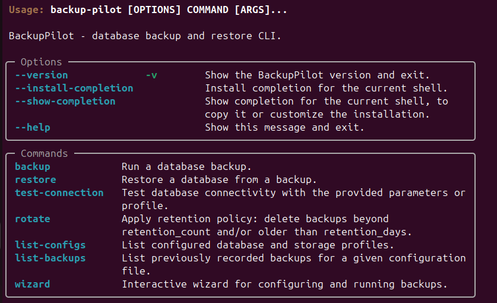

# BackupPilot



BackupPilot is a cross-platform Python command-line utility for backing up and restoring multiple databases with pluggable storage backends (local filesystem, AWS S3, Google Cloud Storage, Azure Blob Storage), compression, and optional notifications.

## Features

- **Multiple databases**: MySQL, PostgreSQL, MongoDB, SQLite (extensible to others).
- **Backup types**: Full, plus initial incremental and differential backups backed by database-native logs (binlog, WAL, oplog) where supported.
- **Storage options**: Local filesystem, AWS S3, Google Cloud Storage, Azure Blob Storage.
- **Compression**: Gzip by default, with an extensible compression interface.
- **Encryption**: Optional at-rest encryption for backups; use `encryption: none` (default) or `encryption: fernet` with the key supplied via the `BACKUP_PILOT_ENCRYPTION_KEY` environment variable (base64-encoded Fernet key).
- **Backup rotation**: Optional retention per profile (`retention_count` and/or `retention_days`); run `backup-pilot rotate` to delete old backups.
- **Logging**: Config-driven log level, optional file output, and JSON format (see `logging` in config).
- **Notifications**: Slack and email notifiers with error handling so backup/restore never fail due to notification delivery.
- **Restore operations**: Restore from backup artifacts, with selective restore where supported.
- **Backup history**: Per-config backup history tracking with a `list-backups` command showing backup metadata.

## Installation

```bash
pip install .
```

This will install the `backup-pilot` executable.

## Quickstart

Show CLI help:

```bash
backup-pilot --help
```

### Example configuration

Create a `backup_pilot.yaml` file in your working directory (or use one of the example configs under `examples/`):

```yaml
databases:
  local_mysql:
    type: mysql
    host: localhost
    port: 3306
    username: root
    password: example
    database: app_db

storage:
  local_fs:
    type: local
    options:
      root_dir: ./backups

backups:
  daily_mysql_full:
    database: local_mysql
    storage: local_fs
    backup_type: full
    compression: gzip
    # encryption: none   # default; use "fernet" and set BACKUP_PILOT_ENCRYPTION_KEY for encrypted backups
    # retention_count: 7   # keep at most 7 backups per profile
    # retention_days: 30   # delete backups older than 30 days

# logging:
#   level: INFO
#   file: /var/log/backup_pilot.log
#   json: false

notifications:
  slack:
    webhook_url: "https://hooks.slack.com/services/XXX/YYY/ZZZ"
  # email (optional; from, to, smtp_host required):
  #   smtp_host: smtp.example.com
  #   smtp_port: 587
  #   username: "${SMTP_USERNAME}"
  #   password: "${SMTP_PASSWORD}"
  #   from: backup-pilot@example.com
  #   to: ops@example.com
```

Run a backup using the profile:

```bash
backup-pilot backup --profile daily_mysql_full --config-file backup_pilot.yaml
```

### Configuration via .env

When running `backup-pilot` directly on your host, BackupPilot will automatically
load environment variables from a `.env` file in the current working directory
if it exists. OS-level environment variables always take precedence.

To get started:

1. Copy `.env.example` to `.env`.
2. Fill in values such as `BACKUP_PILOT_ENCRYPTION_KEY`, cloud storage
   credentials, and notification settings.
3. Run your backup command:

```bash
backup-pilot backup --profile daily_mysql_full --config-file backup_pilot.yaml
```

Each successful backup is recorded in a history file that lives next to your config file:

- For `backup_pilot.yaml` the history file is `backup_pilot.history.jsonl`.
- Each line is a JSON record containing the backup ID, profile, database type/name, storage location, timestamps, backup type, and (where available) size in bytes.

You can list recorded backups:

```bash
backup-pilot list-backups --config-file backup_pilot.yaml
```

Filter by profile and limit the number of results:

```bash
backup-pilot list-backups --config-file backup_pilot.yaml --profile daily_mysql_full --limit 10
```

Restore from a backup:

```bash
backup-pilot restore --profile daily_mysql_full --backup-id 20250101010101 --config-file backup_pilot.yaml
```

List configured profiles:

```bash
backup-pilot list-configs --config-file backup_pilot.yaml
```

Test a database connection:

```bash
backup-pilot test-connection --db-profile local_mysql --config-file backup_pilot.yaml
```

Run retention (rotate old backups according to `retention_count` / `retention_days`):

```bash
backup-pilot rotate --config-file backup_pilot.yaml
backup-pilot rotate --config-file backup_pilot.yaml --profile daily_mysql_full
```

The CLI currently exposes the following top-level commands:

- `backup-pilot backup`
- `backup-pilot restore`
- `backup-pilot rotate`
- `backup-pilot test-connection`
- `backup-pilot list-configs`
- `backup-pilot list-backups`
- `backup-pilot wizard run` (interactive configuration and optional execution)

### Interactive wizard

You can use the wizard to interactively create or update a configuration and optionally run a backup immediately:

```bash
backup-pilot wizard run --config-file backup_pilot.yaml
```

The wizard will prompt you for:

- **Database type** (MySQL/MariaDB, PostgreSQL, MongoDB, SQLite)
- **Connection details** (host, port, username, password, database name)
- **Storage profile** (local path)
- **Backup profile name and backup type** (`full`, `incremental`, or `differential`)

At the end, it saves the configuration and, by default, runs the backup using the new profile.

### Incremental and differential backups

BackupPilot models backup types as:

- **Full**: A complete logical dump of the database.
- **Incremental**: Logically associated with changes since the **last backup of any type** (full, incremental, or differential).
- **Differential**: Logically associated with changes since the **last full backup**.

For MySQL, PostgreSQL, and MongoDB, BackupPilot records database-native log positions per backup job. **Incremental and differential backups require additional database-level configuration** so that these log positions are available:

- **MySQL/MariaDB**: Binary log file and position from `SHOW MASTER STATUS` via `mysql` / `mysqldump`.
  - Enable binary logging in your MySQL/MariaDB configuration, for example:

    ```ini
    [mysqld]
    server-id = 1
    log_bin = /var/log/mysql/mysql-bin.log
    binlog_format = ROW
    ```

  - Ensure that running `SHOW MASTER STATUS;` as the BackupPilot user returns a row with `File` and `Position`. If BackupPilot cannot parse this output, incremental/differential MySQL backups will fail with a `BackupError` explaining that binary logging must be enabled.

- **PostgreSQL**: Current WAL LSN via `psql` using `pg_current_wal_lsn()` or `pg_current_xlog_location()`.
  - Ensure WAL is enabled and the BackupPilot user has permission to call the appropriate function.

- **MongoDB**: Oplog timestamp from the `local.oplog.rs` collection, using `mongosh`.
  - Run in replica set mode with an oplog configured, and ensure the BackupPilot user can read from `local.oplog.rs`.

When these prerequisites are not met, incremental and differential backups will raise a `BackupError` with a message describing the missing requirement (e.g., binlog/WAL/oplog not enabled or not accessible).

This metadata is persisted under a `.backup_pilot/` directory (by default in the current working directory) and is used to track the last full and last backup positions for each job. Future versions can leverage these stored positions to narrow backups to only the relevant changes.

### Rotation and safety for incremental/differential chains

When you enable rotation using `retention_count` and/or `retention_days`, BackupPilot applies the policy **per backup profile**. Rotation deletes old backup artifacts from the configured storage backend and rewrites the history file to keep only the retained records.

To avoid breaking incremental or differential chains:

- **Full backups that have incremental or differential backups related to them are never deleted by rotation.**
- A "related" backup means an incremental or differential backup recorded **after** a given full backup for the same profile in the history file.
- This can result in keeping more full backups than `retention_count` alone would suggest, but it guarantees that incremental and differential backups are never left without their required base full backup.

## Docker

Build the image:

```bash
docker build -t backup-pilot .
```

Run a backup (mount config and backup directory; set env vars for credentials/keys as needed):

```bash
docker run --rm -v /path/to/backup_pilot.yaml:/config/backup_pilot.yaml -v /path/to/backups:/backups backup-pilot backup --profile daily_mysql_full --config-file /config/backup_pilot.yaml
```

Use environment variables for secrets (e.g. `BACKUP_PILOT_ENCRYPTION_KEY`, `AWS_ACCESS_KEY_ID` / `AWS_SECRET_ACCESS_KEY` for S3, or your cloud provider’s preferred vars).

The Docker image includes the following OS-level database client tools:

- **MySQL/MariaDB**: `mysql`, `mysqldump`
- **PostgreSQL**: `psql`, `pg_dump` (via `postgresql-client`)
- **MongoDB**: `mongosh`, `mongodump`, `mongorestore`

If you run BackupPilot outside Docker, ensure these tools are installed on your system and available on `PATH`.

## CI

GitHub Actions workflow (`.github/workflows/ci.yml`) runs on push and pull requests: tests (Python 3.10–3.12), Ruff and Black lint, and package build.

## Examples

- **Basic local backup config**: `examples/config-basic.yaml`
- **AWS S3 backup config**: `examples/config-aws.yaml`
- **Google Cloud Storage backup config**: `examples/config-gcp.yaml`
- **Azure Blob Storage backup config**: `examples/config-azure.yaml`
- **Cron script example**: `examples/cron/backup-mysql-daily`

These examples are starting points; you should adapt hostnames, credentials, buckets/containers, and schedule to your environment.

